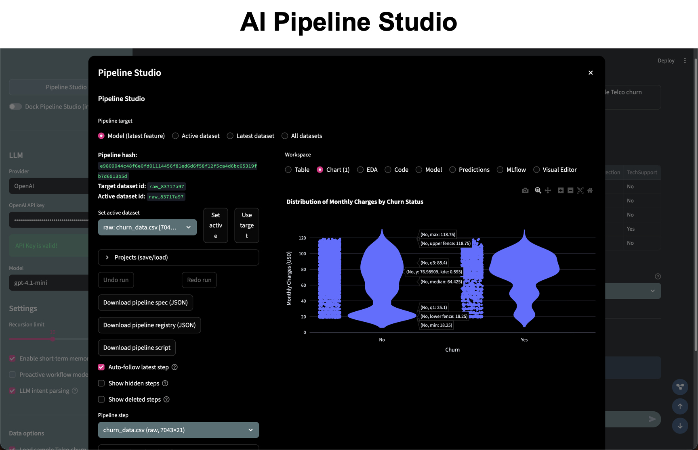

# Data Agnets

A Python library that gives you a team of specialized AI agents for everyday data science work. Each agent handles one piece of the pipeline -- loading data, cleaning it, wrangling it into shape, building charts, running models -- and they can be composed together or orchestrated by a supervisor to tackle end-to-end analysis tasks.

The library also ships with **AI Pipeline Studio**, a Streamlit application that wraps these agents in a visual, pipeline-first interface. You connect data sources, chain together manual and AI-driven steps, and get reproducible scripts out the other end.

**Current status:** Beta (v0.0.0.9017). The API is settling but expect occasional breaking changes before 0.1.0.

## What is in the box

The project is split into two halves:

1. **The library** (`data_agnets/`) -- importable agents and tools you can use from notebooks or scripts.
2. **The apps** (`apps/`) -- ready-to-run Streamlit applications built on top of the library.

### Agents

Each agent wraps a LangGraph state graph and a language model. You pass in data and natural language instructions; the agent writes and executes Python code to carry out the task, then hands back the result.

| Agent | What it does |
|---|---|
| DataLoaderToolsAgent | Finds and loads files from your filesystem (CSV, Excel, Parquet, etc.) |
| DataCleaningAgent | Handles missing values, type casting, outlier treatment |
| DataWranglingAgent | Reshapes, filters, groups, joins -- general pandas transformations |
| FeatureEngineeringAgent | Creates new features, encodes categoricals, scales numerics |
| DataVisualizationAgent | Generates Plotly charts from your data and instructions |
| EDAToolsAgent | Runs exploratory analysis: distributions, correlations, missing-value reports |
| SQLDatabaseAgent | Connects to SQL databases and generates queries from plain English |
| H2OMLAgent | Trains machine learning models through H2O AutoML |
| MLflowToolsAgent | Logs experiments, registers models, queries the MLflow tracking server |

### Multi-agent workflows

For tasks that need more than one agent, the library provides composite classes:

- **PandasDataAnalyst** -- chains a DataWranglingAgent and a DataVisualizationAgent. Give it raw data and a question, and it wrangles the data then plots the answer.
- **SQLDataAnalyst** -- similar idea but starts from a SQL database instead of a DataFrame.
- **Supervisor** -- a routing agent that picks which sub-agent to call next, passing context between them until the task is done.

### Tools

The `tools/` package contains the LangChain-compatible tool functions that agents call under the hood:

- `data_loader` -- file I/O utilities (load single files, scan directories, search by pattern)
- `dataframe` -- DataFrame inspection and summary helpers
- `eda` -- statistical analysis and profiling tools
- `sql` -- SQL connection and query execution
- `h2o` -- H2O model training and prediction wrappers
- `mlflow` -- MLflow experiment tracking and model registry operations

## Getting started

### Requirements

- Python 3.9 or newer
- An OpenAI API key, or a running Ollama instance if you want to use local models

### Installation

Clone the repository and install in editable mode:

```bash
git clone https://github.com/Aamod007/data-agnets.git
cd data-agnets
pip install -e .
```

For machine learning features (H2O, MLflow):

```bash
pip install -e ".[machine_learning]"
```

For extra data science tools (pytimetk, missingno, sweetviz):

```bash
pip install -e ".[data_science]"
```

Or install everything:

```bash
pip install -e ".[all]"
```

### Set up your LLM

**OpenAI:**

```python
from langchain_openai import ChatOpenAI

llm = ChatOpenAI(model_name="gpt-4.1-mini")
```

**Ollama (local):**

First start the Ollama server and pull a model:

```bash
ollama serve
ollama pull llama3.1:8b
```

Then in Python:

```python
from langchain_ollama import ChatOllama

llm = ChatOllama(model="llama3.1:8b")
```

### Quick example

```python
import pandas as pd
from data_agnets import DataCleaningAgent
from langchain_openai import ChatOpenAI

llm = ChatOpenAI(model_name="gpt-4.1-mini")

agent = DataCleaningAgent(model=llm)

df = pd.read_csv("your_data.csv")
agent.invoke_agent(
    user_instructions="Handle missing values and fix column types.",
    data_raw=df,
)

cleaned_df = agent.get_artifacts()
```

## AI Pipeline Studio

The flagship application. It gives you a visual workspace where you build data pipelines by connecting nodes -- each node is either a manual step or an AI agent call. Everything is tracked, and you can export the pipeline as a standalone Python script.



Features:

- Visual pipeline editor with drag-and-drop nodes
- Table, chart, EDA, code, and model views for each step
- Multi-dataset handling with merge workflows
- Project save and load (metadata-only or full-data snapshots)
- MLflow integration for experiment tracking

To run it:

```bash
streamlit run apps/ai-pipeline-studio-app/app.py
```

Detailed documentation for the app lives in `apps/ai-pipeline-studio-app/README.md`.

### Other apps

| App | Path | Description |
|---|---|---|
| Pandas Data Analyst | `apps/pandas-data-analyst-app/` | Upload CSV/Excel, ask questions, get tables and plots back |
| EDA Explorer | `apps/exploratory-copilot-app/` | Interactive exploratory data analysis with AI assistance |
| SQL Database Agent | `apps/sql-database-agent-app/` | Connect to a SQL database and query it in plain English |

## Project structure

```
data-agnets/
    data_agnets/        # The Python package
        agents/                  # Individual agent implementations
        ds_agents/               # Data science-specific agents (EDA)
        ml_agents/               # Machine learning agents (H2O, MLflow)
        multiagents/             # Composite agents and supervisor
        tools/                   # LangChain tool functions
        templates/               # BaseAgent class and agent templates
        parsers/                 # Output parsers
        utils/                   # Shared utilities
    apps/                        # Streamlit applications
    examples/                    # Jupyter notebook examples
    data/                        # Sample datasets
    img/                         # Images and logos
    setup.py                     # Package configuration
    requirements.txt             # Core dependencies
```

## Examples

The `examples/` directory contains Jupyter notebooks that walk through each agent individually:

- `data_loader_tools_agent.ipynb` -- loading and searching for files
- `data_cleaning_agent.ipynb` -- cleaning messy datasets
- `data_wrangling_agent.ipynb` -- reshaping and transforming data
- `data_visualization_agent.ipynb` -- generating charts
- `feature_engineering_agent.ipynb` -- creating new features
- `sql_database_agent.ipynb` -- querying SQL databases

Advanced topics and multi-agent examples are in `examples/advanced_topics/`, `examples/multiagents/`, and `examples/teams_of_agents/`.

## Dependencies

Core dependencies (installed automatically):

- LangChain, LangGraph, and langchain-openai for agent orchestration
- pandas, numpy for data manipulation
- Plotly for visualization
- Streamlit for the web applications
- scikit-learn, xgboost for built-in model support
- SQLAlchemy for database connectivity

Optional dependencies are grouped under extras (`machine_learning`, `data_science`, `all`).

## License

MIT License. See [LICENSE](./LICENSE) for the full text.

## Author

Aamod Kumar

